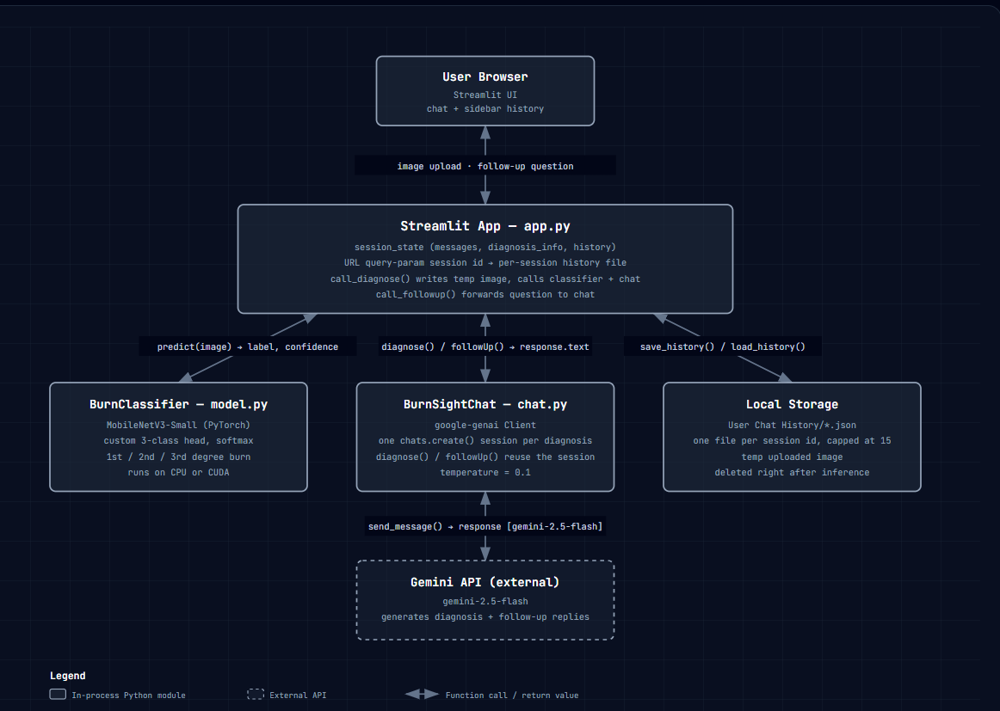
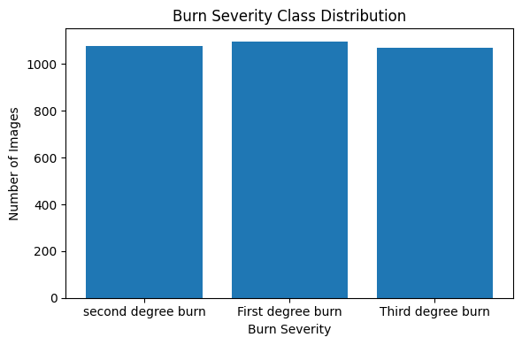
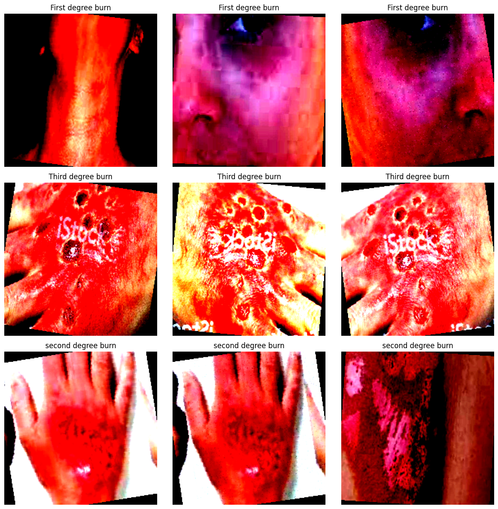
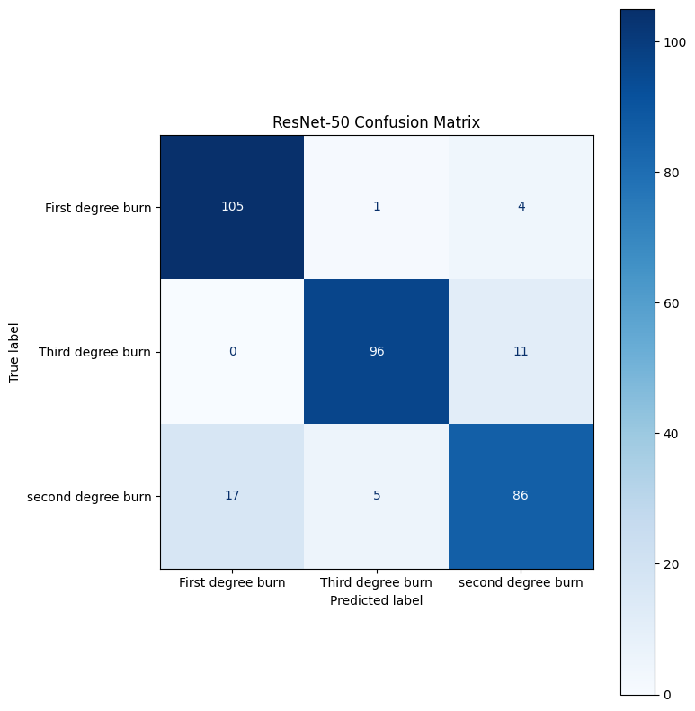
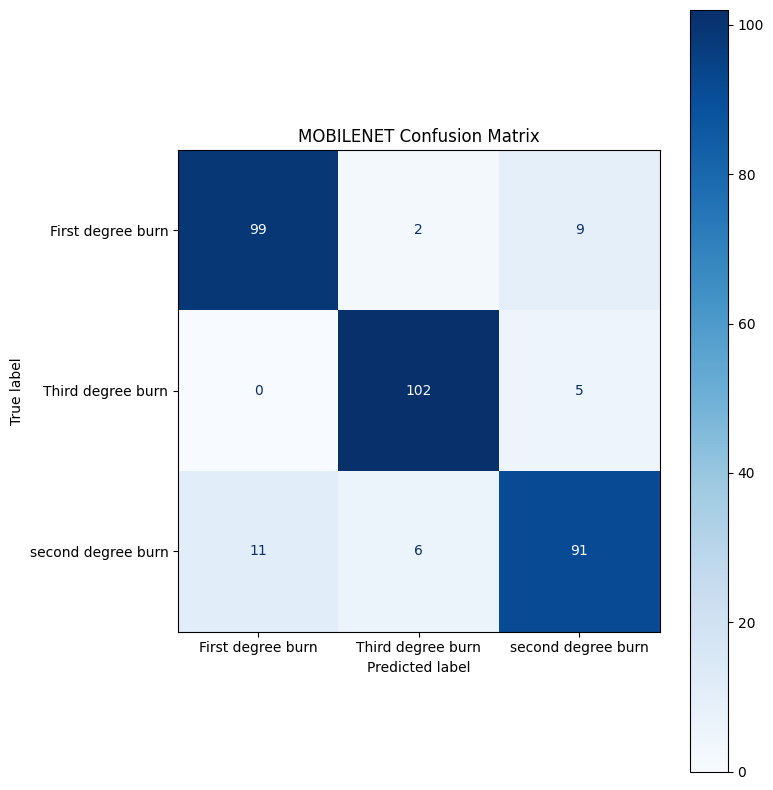

# <h1 align="center">BurnSight AI</h1>

BurnSight AI is a chatbot that integrates a CNN with an LLM to classify burn severity and generate first-aid recommendations respectively. See a demo [here!](https://burnsightai.streamlit.app/)

## Table of Contents

- [1. Introduction](#1-introduction)
  - [1.1 Motivation](#11-motivation)
  - [1.2 Relevant Research](#12-relevant-research)
- [2. System Overview](#2-system-overview)
  - [2.1 Tech Stack](#21-tech-stack)
  - [2.2 Architecture Diagram](#22-architecture-diagram)
  - [2.3 Pipeline](#23-pipeline)
- [3. Model Development](#3-model-development)
  - [3.1 Dataset](#31-dataset)
  - [3.2 Preliminary Analysis](#32-preliminary-analysis)
  - [3.3 Model Selection](#33-model-selection)
  - [3.4 Model Evaluation](#34-model-evaluation)
- [4. Limitations & Future Work](#4-limitations--future-work)
  - [4.1 Limitations](#41-limitations)
  - [4.2 Future Work](#42-future-work)
## 1. Introduction

### 1.1 Motivation

My motivation for working on this project started when I noticed Gemini struggling to confidently identify common injuries based on the image alone. To close this gap, I wanted to integrate an image classification model with a Gemini API such that Gemini is just given textual input of a score consisting of the classified injury and the confidence level (probability of it being that injury) where based on the inputted score, Gemini would output a recommended care plan if there was a high enough confidence score (set to be 67% though it may later change). This is to ensure that when the model is uncertain, it does not give a potentially incorrect classification. 

Originally, I wanted to build a more generalized "First-Aid" chatbot that given an image of
an injury, it would classify the injury and give "First-Aid" type advice on how to treat it
before recieving medical attention. The user could also ask additional questions if necessary. 

However, an issue I faced while developing the classifier was data. There was a lack of datasets of common First-Aid injuries such as bruises and burns on sites such as RoboFlow and Kaggle. I alternatively could've created my own dataset but as the focus of the project was medical injuries, with poor data, the model could risk in classifying an injury incorrectly leading to wrong treatment and therefore, worsening the injury. 

Due to these issues, I decided to narrow down my focus to only burn injuries and classifying the severity of each burn. From all the injuries I could've focused on, I chose burns because burns are the fourth most common injury after road traffic accidents, falls, and physical violence [[1]](https://www.nejm.org/doi/full/10.1056/NEJMra1807442). Additionally, when it comes to treating burns, First-Aid plays a critical role by reducing burn complications such as lowering the risk of infection. [[2]](https://onlinelibrary.wiley.com/doi/10.1155/2018/1092650).

### 1.2 Relevant Research

1. [Mobile App for Burn Classification:](https://www.sciencedirect.com/science/article/pii/S0305417924000135) Similar project that uses YOLO instead of a CNN for burn severity classification. Does not integrate an LLM for treatment recommendation. 

2. [AI-Driven Integrated System for Burn Depth Prediction With Electronic Medical Records: Algorithm Development and Validation](https://pmc.ncbi.nlm.nih.gov/articles/PMC12356521/): Uses a VLM for burn classification. Requires ultrasound images and expert instruction to properly classify the burn. While highly suitable for clinical settings, it relies on information that is generally unavailable during first-aid situations, making it less applicable for consumer use.

3. [AI-based burn image assessment: Reliability and clinical error patterns of multimodal large language models in a repeated-inference study](https://www.sciencedirect.com/science/article/pii/S1748681526003372): Compares the performance of multiple multimodal models on burn severity. Gemini reported $76.4 \pm 6.8$ percent accuracy on the dataset. This was the highest standard deviation value from all the models tested showing that Gemini alone has high variability for burn classification. 

## 2. System Overview

### 2.1 Tech Stack

* **App:** [Streamlit](https://streamlit.io/)
* **Machine Learning:** [PyTorch](https://pytorch.org/), [Transformers (Hugging Face)](https://huggingface.co/docs/transformers/index), [Torchvision](https://pytorch.org/vision/stable/index.html), 
[Pillow (PIL)](https://python-pillow.org/):
* **LLM:** [Google Gemini API](https://ai.google.dev/) 

### 2.2 Architecture Diagram



### 2.3 Pipeline
1. **Session Initialization:** When the application loads, a new session id (uuid) is created for the current session of the application. The session id remains the same if the application is reloaded. This is because each session id is unique to the application session. A new json file storing history is created for each session id.
2. **Image Upload:** The user uploads an image of a burn the frontend. The image is only stored for classification purposes and deleted after a classification is made. 
3. **Image Preprocessing:** The uploaded image is passed directly to the Burn Classifier model (fine-tuned MOBILENET-V3). The image is resized and normalized according to the preprocessing requirements of the model. 
4. **Burn Classification:** The pretrained model uses the image input to output $3$ logit values. These $3$ logit values are passed through a softmax to find the probabilities for each of the burn severities. Then the maximum probability is decided as the classification. 
5. **LLM Processing:** The Gemini API is prompted as a medical assistant with inputs being the confidence and prediction of the pretrained model. These inputs are used to generate recommended First-Aid methods for each burn. 
6. **Conversation Initialization:** After the initial diagnosis, a unique conversation id is created (uuid)(essentially anytime you open a new chat). After each chat it verifies if it belongs to an existing conversation, else it creates a new one. Each time the chat is added to json file for the respective session id history file. 
7. **Follow-Up Questions:** The user can ask follow-up questions about the diagnosed burn. These messages are associated with the current conversation ID, allowing the application to maintain the context of the original diagnosis when generating subsequent responses. Google search was initally integrated for verification of results but later removed as it enabled the LLM to answer off-topic questions. A future fix is TBD. 
8. **History Deletion:** When running, if a history json file is older than a day. 


# 3. Model Development

1. [ResNet-50](https://colab.research.google.com/drive/17dydPsf6V2DKq8bPlat5fKluiCOGDndm?usp=sharing)
2. [MOBILENET-V3](https://colab.research.google.com/drive/1StbyPNOK7BWBWr1DsLJ0s5SuWXnZKiaN#scrollTo=aaPwtbZaXf98)

## 3.1 Dataset

Run the following code to load the dataset used for training our image classification model:
  ```
  !pip install roboflow

from roboflow import Roboflow
rf = Roboflow(api_key="API KEY")
project = rf.workspace("first-aid-vfyay").project("first-aid-app-2fa7k")
version = project.version(4)
dataset = version.download("folder")
  ```

For more details visit the RoboFlow [here](https://universe.roboflow.com/first-aid-vfyay/first-aid-app-2fa7k/dataset/4). You will need to access RoboFlow to get the API key to access the dataset.

## 3.2 Preliminary Analysis

A lot of this information is also available on RoboFlow but here is a brief overview.

The dataset consists of $3243$ images total of three classes: 'First degree burn', 'second degree burn', and 'Third degree burn'. However, due to the way the files are structured, the classes appear the classes are mapped in the following order:

```
Training: {'First degree burn': 0, 'Third degree burn': 1, 'second degree burn': 2}
Validation: {'First degree burn': 0, 'Third degree burn': 1, 'second degree burn': 2}
Testing: {'First degree burn': 0, 'Third degree burn': 1, 'second degree burn': 2}

```
So, if the model predicts the value $1$, it is referring to a 'Third degree' burn rather than a 'second degree burn'. 



The graph above shows the distribution of data across the different classes. As we can see it is relatively uniform suggesting an equal distribution between the different burn severities. This suggests that accuracy is a good metric to evaluate the performance of the model. 

RoboFlow had provided an already split dataset and claims to follow an $80-10-10$ split between training-validation-testing data as shown in the code output below. 

```
Training: 2595
Validation: 323
Testing: 325
```
Mathematically, we can verify that RoboFlow is correct.

**Training**: $\frac{2595}{2595+323+325}\times100=80.06$

**Validation**: $\frac{323}{2595+323+325}\times100=9.96$

**Testing**: $\frac{325}{2595+323+325}\times100=9.96$

The images are of dimensions $224\times224$ which is great because most pretrained models are trained on IMAGENET which uses the $224\times224$ image size. Below are some examples of how the data looks like.



## 3.3 Model Selection

Though recent research has shown strong performance with vision transformers for many computer vision tasks, they are data hungry. Our dataset only consists of a bit over 3000 images and will cause the vision transformer to overfit. Therefore, I chose to go with a simpler approach and work with Convolutional Neural Networks (CNNs). Unlike CNNs, vision transformers also don't have a built-in understanding of local structures (i.e. Inductive Bias). This is essential because when classifying burns, local characteristics can potentially reveal patterns important for classifying particular burns such as blistering. 

Instead of creating a CNN from scratch, we wanted to use transfer learning. **Transfer Learning** is essentially when you use a pretrained model on a large dataset and then train only a smaller portion of the model on a smaller dataset to get a strong performance for specific tasks. Aside from the learning experience, we chose transfer learning for the lower training time and stronger performance than if we trained a CNN from scratch. 

For this project we evaluated two pretrained models, both of which were trained on the IMAGENET dataset. 

* **ResNet-50:** Standard benchmark model for image classification. Consists of 25.6 million parameters. 
* **MOBILENET-V3:** A more lightweight CNN built for mobiles and edge devices (e.g. phones and microcontrollers). Known for fast inference times but possiblilty for lower performance than ResNet-50. Has only 3 million parameters. 

To see what hyperparameters were fine-tuned and what layers we froze, please visit the linked notebooks at the top of this section. 

**Note:** To learn more about the Transformers library, we chose to use that for transfer learning of ResNet-50 instead of the torchvision counterpart. Both models have the same architecture so ideally there should be no difference in performance. 
## 3.3 Model Evaluation

One of the most important deciding factors for model selection in our scenario would be recall. Recall that "recall" (pun not intented) is calculated by the following formula: $\dfrac{TP}{TP+FN}$ where $TP$ is True Positive and $FN$ is False Negative. In the scenario of burn classification, recall would be a measure of how many burns were correctly classified of the total burns of that category in the data. So, if there was $7$ first degree burns and $2$ of them were correctly classified, the recall percentage would be $\dfrac{2}{7}\times100=28.6$ percent. A low recall for any burn category means that many burns of that severity are being misclassified, reducing the reliability of the system. Since the first-aid recommendations generated by the application are based on the predicted burn severity, misclassifications could result in inappropriate guidance being provided to the user. Therefore, achieving consistently high recall across all burn classes was a primary consideration during model selection.

Below is a classification report comparing both models on the test data with multiple metrics including recall.

| Model           | Class              | Precision |   Recall | F1 Score | Support |
| :-------------- | :----------------- | --------: | -------: | -------: | ------: |
| **ResNet-50**    | First-Degree Burn  |      0.86 |     0.95 |     0.91 |     110 |
|                 | Second-Degree Burn |      0.94 |     0.90 |     0.92 |     107 |
|                 | Third-Degree Burn  |      0.84 |     0.83 |     0.82 |     108 |
|                 | **Macro Avg**      |  **0.88** | **0.88** | **0.88** | **325** |
|                 | **Weighted Avg**   |  **0.88** | **0.88** | **0.88** | **325** |
| **MOBILENET-V3** | First-Degree Burn  |      0.90 |     0.90 |     0.90 |     110 |
|                 | Second-Degree Burn |      0.93 |     0.95 |     0.94 |     107 |
|                 | Third-Degree Burn  |      0.87 |     0.84 |     0.85 |     108 |
|                 | **Macro Avg**      |  **0.90** | **0.90** | **0.90** | **325** |
|                 | **Weighted Avg**   |  **0.90** | **0.90** | **0.90** | **325** |


From the table above, we can see the for each burn severity except for the first degree burn, MOBILENET-V3 had a higher recall rate than ResNet-50. The same can be said for other measured metrics including precision and F1 score (ResNet-50 has the edge at recall for first-degree burns and precision for second-degree burns). 

One thing to keep in mind is that the test dataset was only 325 images. In the data above the largest percent difference was 5 percent, which for the second-degree burn which would translate to $0.05\times107=5.25$ or $5$ images. Therefore, the results should not be interpreted as evidence that MOBILENET-V3 is definitively superior to ResNet-50. If a larger test set, or evaluation across multiple independent test sets was available,it would provide a more reliable estimate of the models' relative performance.

Therefore, we go to compare model performance against the next metric: confusion matrix. From the confusion matrix we would be able to tell how many false positives or false negatives both models give out on the test data. This is important because if a user has a first degree burn and the model classifies it as a third-degree, the user would be more away and therefore seek medical attention faster.


| ResNet-50 | MOBILENET-V3 |
| :---: | :---: |
|  |  |

When comparing the performance on the test dataset, the difference is almost negligible. For example, ResNet-50 correctly classifies $\frac{105+96+86}{325}\times100=88.3$ percent while MOBILENET-V3 correctly classifies $\frac{99+102+91}{325}\times100=89.8$ percent. The difference in accuracy is just $(99+102+91)-(105+96+86)=5$ images which is not a major difference. 

Therefore, the next thing we look at would be false negatives. Each burn degree has different treatment but applying the treatment for a first-degree burn to a second-degree burn can cause the burn to get worse. Below is a calculation for how many burns were classified with a lower degree than it should be for each model.

* **ResNet-50:** $17+0+11=28$
* **MOBILENET-V3:** $11+0+5=16$

This is a difference of $12$ images. In high stake scenarios such as medical scenarios, the ideal percentage is generally considered to be between $1-5$ percent. In this scenario, MOBILENET-V3 has the edge due to $\dfrac{16}{325}\times100=4.92$ percent being closer than $\dfrac{28}{325}\times100=8.61$ percent to the given range. 

Due to being in the optimal range of false negatives allowed, we chose to deploy MOBILENET-V3 for the application. 

To compare the results from other metrics please visit the Google Colabs above. 

# 4. Limitations & Future Work

## 4.1 Limitations

The biggest limitation with this project is data. $325$ images is not a lot of images to make a strong claim about model performance as there is a huge difference in percentage just from a few images. Additionally, the dataset is mostly biased towards light-skinned people and adults due that being most of the images available online. Most of the images for darker skin and babies with burns is often unlabeled so it would be difficult to integrate into a dataset. This can lead to poorer performance on underrepresented groups because the model may not learn characteristics that are present in data different from what it was trained on.

Another major limitation is a lack of spatial awareness. The LLM is only fed the output of the classifier (prediction and confidence) to provide a diagnosis. Therefore, it is unaware where exactly the burn is located. This is especially important as if the burn is on a sensitive area of the body, it may require a different treatment. To get the valid treatment, the user will have to provide the context when chatting. A scenario such as this is where multimodal models would outweight our methodology. 

## 4.2 Future Work

1. **Integration of a Database:** Currently our application depends on using JSON files for each session to store history. On a large scale, this would not be efficient because managing multiple files would easily get complicated. 
2. **Larger & Diverse Dataset:** Most likely will require manual labeling due to limited available burn severity datasets. Right now, we were unable to easily choose a model due to the differences in model performance being only 5 images in the worst cases scenario. A more diverse dataset would allow for better generalization on various scenarios. The folder [Limit Testing](./limit%20testing/) contains some of these extreme cases that were tested on this model. 
3. **Use of Retrieval-Augmented Generation (RAG):**  The LLM just uses it's pretrained knowledge. For basic first-aid scenarios this is okay. However, for rare cases such as burns on sensitive body parts, the LLM might hallucinate. If Gemini ever hallucinates the user may use the incorrect treatment. To prevent this, we can implement RAG so that we can provide articles from sources such as the Mayo Clinic for Gemini to reference before providing an output. 


 
